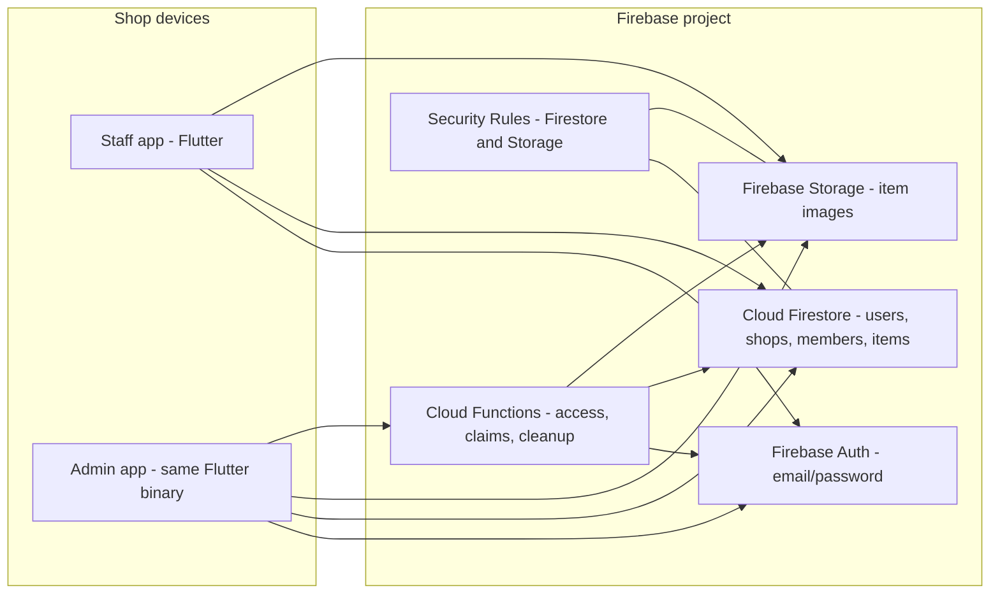
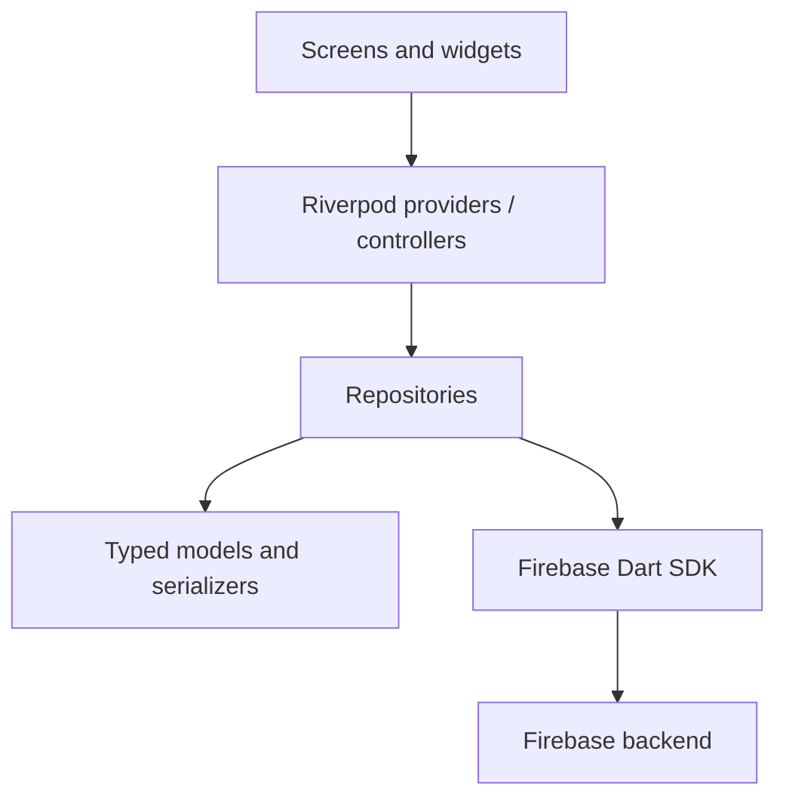
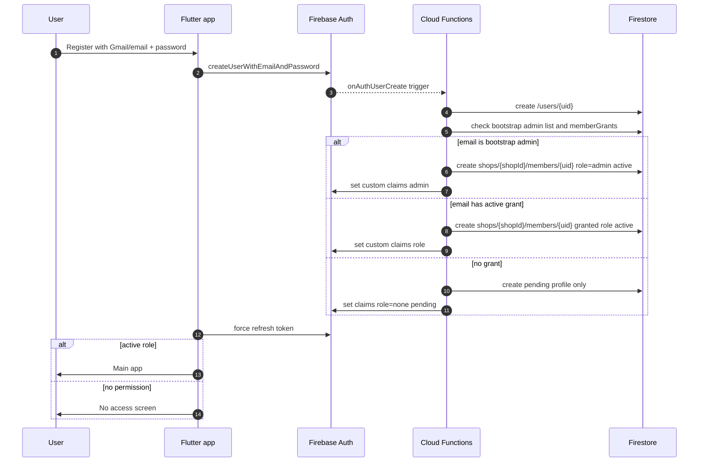
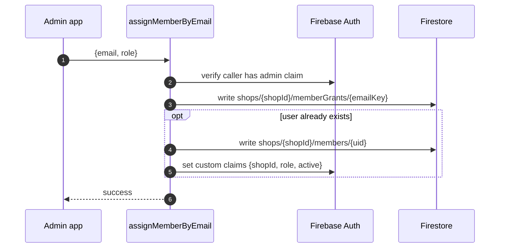
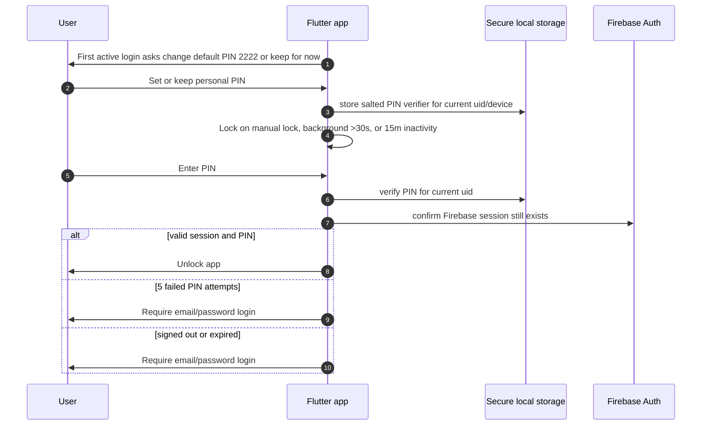
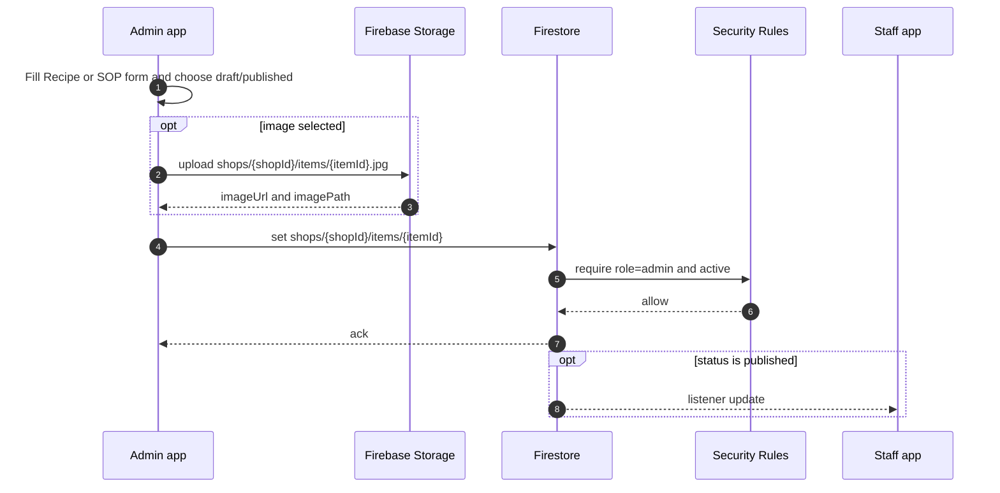
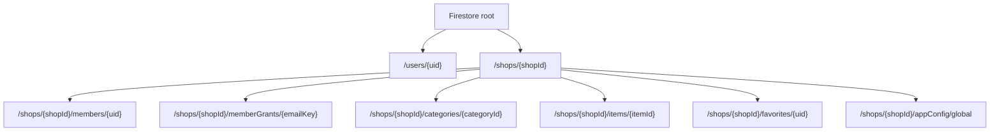
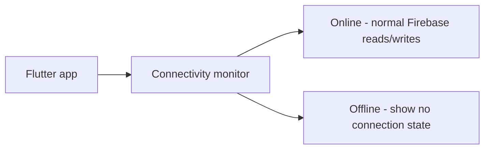
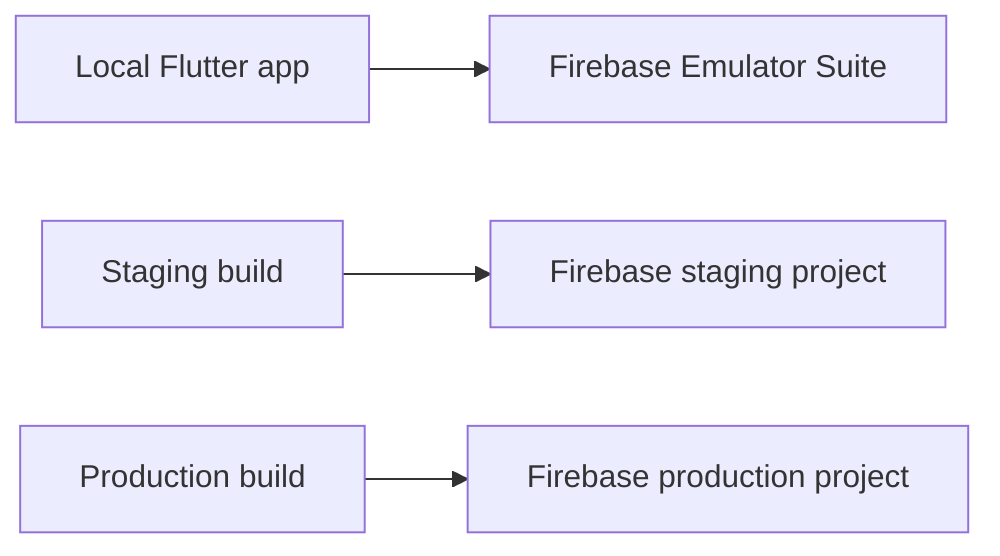

# Tea Recipe & SOP App - Flutter + Firebase System Architecture

Companion to [PRD-flutter.md](./PRD-flutter.md).

This architecture matches the revised Flutter direction:

- Firebase Auth email/password registration.
- Admin-granted shop access by Gmail/email.
- Per-user favorites.
- Per-user local PIN unlock with default first-time PIN `2222`.
- Draft/published content visibility.
- Recipe and SOP content types.
- No offline mode in v1.

---

## 1. High-level system



The same Flutter binary serves both roles. The signed-in user's Firebase Auth
custom claims determine which data can be read and which writes are allowed.

---

## 2. Client layers



Rule: screens never import Firebase SDK packages directly. They consume typed
models and state from providers/controllers.

```text
lib/
  main.dart
  app.dart
  theme/
  l10n/
  core/
    auth/
    firestore/
    models/
  features/
    auth/
    no_access/
    home/
    category/
    item_detail/
    item_form/
    favorites/
    settings/
    admin_users/
  widgets/
```

---

## 3. Registration and access flow



No shop content is read until the refreshed token has an active `staff` or
`admin` claim for the configured shop.

---

## 4. Admin grants access by Gmail/email



If the user registers later, `onAuthUserCreate` picks up the existing grant and
activates the user.

---

## 5. Local PIN unlock



The PIN is not a Firebase credential and does not grant server access by
itself. Biometric unlock is outside v1 and may be added later as an optional
shortcut after a personal PIN exists.

---

## 6. Content write path



`contentType` determines whether the UI reads the `recipe` or `sop` section.
Staff listeners only receive published items. Admin listeners can include draft
and published items.

---

## 7. Firestore data tree



`items` stores both recipes and SOPs. This keeps favorites, search, and
cross-category lists simple. Items use `status = draft | published`; deleted
items are permanently removed.

---

## 8. Security model

Custom claims:

```json
{
  "shopId": "main",
  "role": "staff",
  "accessStatus": "active"
}
```

Required enforcement:

- No auth: no access.
- `role=none` or `accessStatus=pending`: own profile/no-access state only.
- `staff active`: read categories/config, read published items, and write own
  favorites.
- `admin active`: manage content, categories, settings, and users.
- Storage item images: read active members only, write admins only.

The app may hide admin UI, but security rules and callable functions are the
source of truth.

---

## 9. Connectivity

v1 does not support offline mode.



When offline:

- block login/register/access refresh
- block writes
- show no-connection state or blocking banner
- do not promise cached content is current

---

## 10. Environments



Use emulators for security-rules tests and access-flow tests.

---

## 11. Open architecture questions

- Should Google Sign-In be added, or is email/password enough?
- Should the bootstrap admin email live in Cloud Function config instead of
  client code before the first internal test?
